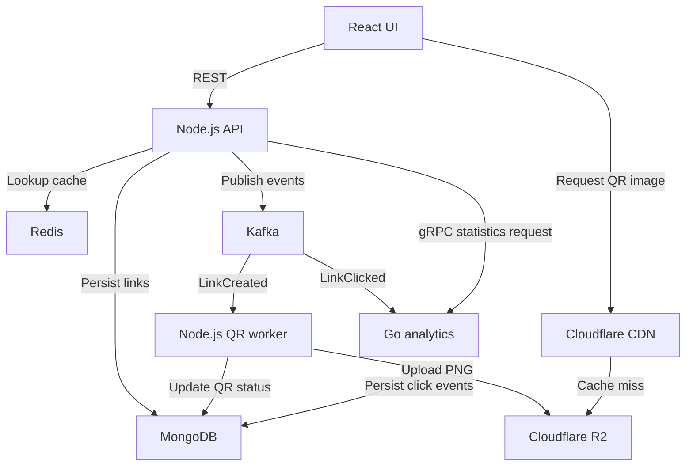

# Link Shortener — Development and Learning Guide

> Build a small URL shortener with downloadable QR codes and click analytics. Use it to practice Redis caching, Kafka, Cloudflare R2, CDN caching, and gRPC between Node.js and Go.
>
> POC focus: learn Redis caching, Kafka, Cloudflare R2, and Go analytics through a working app. Keep the happy path and basic errors small. Advanced validation, recovery flows, benchmarks, and the reliability extension are later exercises, not prerequisites. This is a guide, not a description of features already implemented.

## 1. Product requirements

The user-facing app has two screens:

1. **My links:** paste a destination URL, create a short link, copy it, download its QR code, and browse existing links.
2. **Analytics:** select a link and view clicks over time, total clicks for the selected period, today's clicks, top referrers, and recent activity.

Example:

```text
Destination: https://example.com/portfolio
Short URL:   http://localhost:4000/r/7ced6051-8a2d-4a7d-a57d-9bd1fa9db3e0
QR download: portfolio-qr.png
```

The QR encodes the **short URL**, not the destination. Opening it therefore goes through the same redirect and analytics path.

### Required behavior

- Accept an absolute HTTP or HTTPS destination URL and an optional title.
- Use a full UUID for the link ID and public URL code in the POC.
- Persist links in MongoDB with a unique index on the short code.
- Redirect valid short links with HTTP `302`.
- Return `404` for an unknown short code.
- Cache redirect lookups in Redis; continue working if Redis is unavailable.
- Generate a PNG QR code asynchronously through a Kafka consumer.
- Upload QR images to R2 and display their availability in the UI.
- Serve public QR images through a Cloudflare-backed custom domain when the CDN milestone is complete.
- Publish click events and consume them in a Go analytics service.
- Fetch analytics from Go through gRPC, with Node.js exposing the browser-facing REST endpoint.
- Show loading, empty, pending-QR, failed-QR, and unavailable-analytics states.

### Keep the first version small

The initial app is a local, single-user learning project. No account system is needed. The Go service is for analytics rather than authentication: this meets the cross-language gRPC goal with less product work.

Defer custom aliases, destination editing, link expiration, authentication, payments, geographical lookup, unique-visitor tracking, SVG export, and mobile-specific layouts. Do not treat this local MVP as a public multi-user service; authentication and ownership checks are a separate milestone before opening link management to other users.

Generated UI previews are design references. Their counts, dates, and QR patterns are sample content. The implementation must generate a real, decodable QR code.

## 2. Stack and service boundaries

| Area | Choice | Responsibility |
| --- | --- | --- |
| Frontend | React, TypeScript, Vite | Two screens, URL form, QR state, analytics |
| Styling | Tailwind CSS | Implement the simple white/green UI |
| Server-state handling | TanStack Query | Fetching, polling, error states |
| API | Node.js, TypeScript, Express, Zod | REST endpoints, redirects, event production |
| QR worker | Node.js, TypeScript, `qrcode` | Kafka consumption, PNG generation, R2 upload |
| Analytics service | Go | Kafka click consumption, MongoDB queries, gRPC server |
| Source database | MongoDB | Links and durable analytics events |
| Cache | Redis with the Node `redis` client | Disposable redirect lookup cache |
| Event broker | Apache Kafka | Durable event streams and consumer groups |
| Node Kafka client | KafkaJS | Producers and QR consumer |
| Go Kafka client | `franz-go` / `kgo` | Analytics consumer |
| Object storage | Cloudflare R2 + AWS SDK v3 | Generated PNG objects |
| CDN | Cloudflare cache on an R2 custom domain | Deliver public QR images |
| RPC | `@grpc/grpc-js`, `@grpc/proto-loader`; Go `grpc-go` and protobuf | Node-to-Go analytics calls |
| Local infrastructure | Docker Compose | Kafka, MongoDB, Redis |
| Verification | Vitest, Go testing, API scripts | Critical behavior and integration checks |

Use a supported Node.js LTS release and a current stable Go toolchain. Pin container versions, npm dependencies, and Go modules when setting up the project; commit lockfiles. Check the chosen KafkaJS/broker combination with a produce/consume smoke test before adding application logic. This guide does not depend on an unverified `latest` image.

### Processes

| Process | Local address | Responsibilities |
| --- | --- | --- |
| React | `http://localhost:5173` | Browser UI |
| API | `http://localhost:4000` | REST, redirects, Kafka producer, Redis client |
| QR worker | No public port | Generate and persist QR images |
| Go analytics | `localhost:50051` | Consume click events, serve gRPC |
| Kafka | `localhost:9092` | Broker for host-running app processes |
| Redis | `localhost:6379` | Cache |
| MongoDB | `localhost:27017` | Persistent data |

Initially run app processes on the host and infrastructure in Docker. Configure Kafka's advertised listener to be reachable at `localhost:9092`. If you later containerize the apps, use a separate internal listener such as `kafka:29092`; advertising `localhost` to another container will not reach the broker.

One broker and replication factor `1` are sufficient locally. They do not provide broker-failure redundancy. Persist MongoDB and Kafka with Docker volumes so ordinary restarts do not erase your work.

### Data ownership

- API owns the `links` collection. The QR worker is allowed to update only its `qr` fields as a deliberate simplification for this learning project.
- Go owns `click_events`. Node.js requests analytics through gRPC rather than querying that collection directly.
- Redis stores only data that can be reconstructed from MongoDB. Do not put durable events, outbox records, or essential counters into an evictable cache.
- R2 stores PNG bytes. MongoDB stores their keys and status.

## 3. Architecture



REST handles browser requests. gRPC handles an immediate request/response between services. Kafka handles events that consumers can process later. Redis caches application data near the API; the CDN caches public image responses near visitors. R2 remains the origin for those images.

## 4. End-to-end flows

### A. Create a short link

1. Browser sends `POST /api/links` with a destination and title.
2. API validates the URL. Allow only `http:` and `https:`. Do not fetch the destination as part of link creation.
3. API generates a UUID and uses it as the link ID and public URL code.
4. API inserts a MongoDB document with `qr.status = "pending"`.
5. API publishes `LinkCreated` and awaits the broker acknowledgment.
6. API returns `201` with the link and its current QR state.
7. Browser polls the link detail every two seconds while its QR is pending or processing; stop on ready/failed.

In the early milestone, saving MongoDB data and publishing Kafka data are separate operations. If publishing fails, preserve the link, leave its QR pending, log the failure, and return the created link with a machine-readable warning. Provide a development repair command that republishes the event for that existing link. Do not silently describe this as atomic delivery. The outbox milestone closes this gap.

### B. Generate the QR image

1. QR worker consumes `LinkCreated`.
2. Load the existing link and verify that it still needs the requested QR version.
3. Set QR status to processing.
4. Generate a 512 × 512 PNG with a white background, black modules, and a normal quiet zone. Encode the saved short URL.
5. Upload to `qr/{linkId}/v1.png` with `Content-Type: image/png`.
6. Store `qr.objectKey`, `qr.version`, and `qr.status = "ready"` in MongoDB.
7. Finish processing successfully before committing the message offset.

Use deterministic keys and status updates so a duplicate message does not create a new logical QR asset. If the link already has the same ready QR version, skip redundant work.

An R2 object can be replaced by uploading to the same key; standard object uploads replace the whole object rather than editing bytes in place. For changed QR content, create `v2.png` and a new URL instead of keeping a stale CDN URL.

If processing fails, keep the failure visible. In the first implementation, log it and mark the QR failed. Add bounded retries and a dead-letter topic in the reliability milestone.

### C. Open a short link

1. Browser requests `GET /r/:shortCode`.
2. API checks Redis key `link:{shortCode}`.
3. On a miss, query MongoDB. If the link exists, cache its destination and ID for one hour.
4. Publish a `LinkClicked` event containing a fresh event ID, link ID, UTC timestamp, and normalized referrer hostname if present.
5. Send HTTP `302` with `Location` set to the destination and `Cache-Control: no-store`.

Do not cache redirect responses in Cloudflare for this project: a cache-served redirect could bypass the API and its click event. Cache the QR PNGs instead.

Early delivery policy: try to publish with bounded producer retries/timeouts, then redirect even if Kafka is unavailable. Log the lost event; this stage intentionally permits undercounting rather than preventing navigation. Never use an unhandled fire-and-forget promise. The later outbox milestone persists click events before dispatch; document that stronger durability adds a database write to the redirect path.

Opening a link counts as a redirect request. Bots, previews, and repeated requests can count too. Do not label the metric unique visitors. A missing `Referer` header means unknown/direct, not proof of how the visitor found the link.

### D. Consume clicks and show analytics

1. Go consumes `LinkClicked` and validates the schema.
2. Insert the event into MongoDB using `eventId` as a unique key. An already-present event is a successful duplicate, not an increment.
3. Commit the Kafka offset only after the write succeeds.
4. Browser requests `GET /api/links/:id/stats?days=30`.
5. API verifies the link exists and calls Go's `GetLinkStats` over gRPC with the link ID and time range.
6. Go calculates statistics with MongoDB aggregation and returns the result.
7. API converts the protobuf response to a JSON response for React.

This first analytics implementation stores raw events and derives counts when queried. It avoids a non-atomic "mark processed, then increment counters" design. Materialized counters and transactional updates can be a later optimization.

Analytics is eventually consistent: a redirect can happen before its count appears. An empty result is valid zero activity; an unreachable Go service must produce an unavailable state, not fake zero clicks.

## 5. Data model

Use UUID strings for IDs across Node.js, Go, and Kafka to simplify serialization.

### `links`

```json
{
  "_id": "7ced6051-8a2d-4a7d-a57d-9bd1fa9db3e0",
  "shortCode": "7ced6051-8a2d-4a7d-a57d-9bd1fa9db3e0",
  "shortUrl": "http://localhost:4000/r/7ced6051-8a2d-4a7d-a57d-9bd1fa9db3e0",
  "destinationUrl": "https://example.com/portfolio",
  "title": "Portfolio",
  "createdAt": "2026-10-03T09:00:00.000Z",
  "qr": {
    "status": "pending",
    "version": 1,
    "objectKey": null,
    "updatedAt": "2026-10-03T09:00:00.000Z",
    "errorCode": null
  }
}
```

Store timestamps as BSON dates in MongoDB; JSON responses use ISO 8601 strings. QR statuses: `pending`, `processing`, `ready`, `failed`.

Indexes: unique `shortCode`; `createdAt` for listing. Generate public image URLs from the configured public base URL and object key instead of persisting an environment-specific CDN URL.

### `click_events`

```json
{
  "_id": "a-uuid-event-id",
  "linkId": "a-uuid-link-id",
  "occurredAt": "2026-10-03T09:05:00.000Z",
  "referrerHost": "example.com"
}
```

`referrerHost` is nullable. Store only the hostname, not a full referrer URL or query string. No raw IP addresses or visitor fingerprints are needed for this project.

Indexes: unique `_id` automatically; compound `{ linkId: 1, occurredAt: -1 }`.

Kafka retention and MongoDB retention are separate: expiring old Kafka records does not delete stored click events. Keep click events during development; if you later set a database retention policy, make the UI's available time range match it.

## 6. REST API contract

| Method | Route | Behavior |
| --- | --- | --- |
| POST | `/api/links` | Create a link and trigger QR generation |
| GET | `/api/links?limit=20&cursor=...` | List newest links with bounded pagination |
| GET | `/api/links/:id` | Link metadata, QR state, image URL when ready |
| GET | `/r/:shortCode` | Resolve and redirect; publish click |
| GET | `/api/links/:id/stats?days=30` | Fetch statistics through gRPC |
| GET | `/api/links/:id/qr/download` | Download ready QR as a PNG attachment |
| GET | `/health/live` | Process is alive |
| GET | `/health/ready` | Report readiness according to required dependencies |

Create request:

```json
{
  "destinationUrl": "https://example.com/portfolio",
  "title": "Portfolio"
}
```

Create response contains `id`, `shortCode`, `shortUrl`, `destinationUrl`, `title`, `createdAt`, and a `qr` object with status and nullable image URL. Optional `warnings` describes an early-stage dispatch failure.

For the POC, validate an HTTP/HTTPS URL and an optional string title. Keep normal Express defaults. Add list and stats bounds when those endpoints are implemented.

Keep error responses simple in the POC (a status and readable message); detailed codes below are optional examples:

```json
{
  "error": {
    "message": "Analytics is temporarily unavailable."
  }
}
```

Important status codes: `400` validation; `404` missing link; `409` QR not ready for download; `503` unavailable analytics; `504` analytics deadline exceeded. The redirect returns `302`, not a JSON success body.

### Download details

The gallery-style QR preview uses the CDN image URL. A separate download endpoint reads the server-selected object from R2 and streams it with:

```http
Content-Type: image/png
Content-Disposition: attachment; filename="portfolio-qr.png"
```

Do not buffer arbitrarily large objects or accept an arbitrary object key from the browser. Use the object's key saved on the link. Sanitize filenames. This route is deliberately simple and separate from public preview caching. A cross-origin HTML `download` attribute alone is not a dependable way to force download; an attachment response is clearer.

## 7. Kafka contracts and learning tasks

Current POC infrastructure: Compose runs a single `apache/kafka:4.3.1` KRaft
broker with persistent storage. The API uses KafkaJS 2.2.4 and ensures
`links.created.v1` exists at startup. Creating a link saves MongoDB first, then
publishes `LinkCreated` and awaits acknowledgment. Publishing failures return
the saved link with a warning; `pnpm kafka:republish LINK_ID` repairs delivery
for an existing link. Each creation event reuses the link UUID and stored
creation time so its identity stays stable when republished.
`pnpm kafka:smoke` in `api/` checks a produce/consume round trip on a separate
smoke topic. The click topic and workers are the next milestones.

### Topics and groups

| Topic | Partition key | Initial partitions | Consumer group |
| --- | --- | --- | --- |
| `links.created.v1` | `linkId` | 3 | `qr-workers-v1` |
| `links.clicked.v1` | `linkId` | 3 | `analytics-v1` |
| `links.clicked.v1` | `linkId` | Same topic | `click-audit-v1` (later logging exercise) |

Set local retention to seven days and replication factor to one. Retention is a time-based storage policy, not a guarantee of permanent history.

Event envelope:

```json
{
  "eventId": "a-uuid-event-id",
  "eventType": "LinkClicked",
  "schemaVersion": 1,
  "occurredAt": "2026-10-03T09:05:00.000Z",
  "payload": {
    "linkId": "a-uuid-link-id",
    "referrerHost": "example.com"
  }
}
```

`LinkCreated` uses the same envelope with `payload.linkId`, `payload.shortUrl`, and `payload.qrVersion`. Preserve the event ID when retrying publication of the same logical event.

Validate events in both languages. Keep JSON schemas/fixtures in `contracts/events`. Generated protobuf contracts apply to gRPC; Kafka events use the separately documented JSON contract initially.

### Semantics to implement deliberately

- Workers in the same classic consumer group share partitions; independent groups each read the stream.
- With three partitions, at most three consumers in that group can have assigned partitions. A fourth can be idle.
- Ordering is within a partition, not globally. Keying by link ID puts a link's events together under the configured partitioning scheme; a very popular link can become a hot partition.
- Process messages sequentially within each partition initially. Add bounded concurrency across partitions, not an unbounded promise for every event.
- Commit after successful processing. A crash before committing can cause redelivery.
- Kafka acknowledgment is not proof that a consumer finished the job.
- Kafka's transaction features do not automatically make R2 uploads or MongoDB writes exactly once. Implement safe duplicate handling yourself.
- Maintain heartbeats and session timing while processing, according to the selected client's API. For Go, configure shutdown/rebalance behavior so revoked partitions do not keep writing unchecked.

### Failure and replay exercises

- [ ] Stop QR workers; create ten links; restart and verify all QR jobs are handled.
- [ ] Run two QR workers in the same group and observe partition assignment.
- [ ] Add the audit consumer with a different group and verify both it and analytics receive click events.
- [ ] Crash a QR worker after the R2 upload but before its offset commit; verify one logical ready QR after restart.
- [ ] Publish the same click event twice; verify it adds only one stored event.
- [ ] Replay retained click events into a fresh analytics database/collection using a new consumer group starting at the earliest retained offset.
- [ ] Compare rebuilt statistics to the original over the shared retained period. Older events outside Kafka retention cannot be rebuilt from Kafka.
- [ ] Introduce a malformed event and handle it without looping forever or skipping unrelated data silently.

Reliability extension: bounded exponential-backoff retries; explicit dead-letter topics with original event, error code, and attempt count. Kafka is not a built-in delayed-job scheduler; retry scheduling and poison-message policy are application work. Define when a failed message can be committed after its failure record is durably saved.

## 8. Redis caching and eviction

### Implementation

```text
Key:   link:{shortCode}
Value: {"id":"...","destinationUrl":"https://..."}
TTL:   3,600 seconds
```

Cache-aside algorithm: GET Redis; return a valid hit; otherwise read MongoDB; cache an existing result; continue redirecting even if cache GET/SET fails. Use short connection/command timeouts and avoid excessive repeated failure logs.

Do not cache unknown links initially. With immutable destinations in the MVP, there is no edit invalidation path. When adding editing/deletion later, invalidate the affected key and address concurrent stale cache fills.

Initial Redis configuration:

```conf
maxmemory 32mb
maxmemory-policy allkeys-lru
```

Optional LFU configuration:

```conf
maxmemory 32mb
maxmemory-policy allkeys-lfu
```

Only one policy applies to an instance at a time. LRU uses recency; LFU uses frequency with aging. Redis implementations are approximate. TTL expiration and eviction under memory pressure are different mechanisms. `maxmemory` budgets cache memory; it is not a hard cap on total process RSS, and temporary overshoot/other buffers can exist.

Inspect the running cache:

```bash
docker compose exec redis redis-cli CONFIG GET maxmemory maxmemory-policy
docker compose exec redis redis-cli INFO stats
docker compose exec redis redis-cli INFO memory
```

Compose defaults to a 32 MiB budget and `allkeys-lru`. Set `REDIS_MAXMEMORY` or `REDIS_EVICTION_POLICY` in the root `.env` file and recreate the Redis service to change its startup configuration.

## 9. R2 and Cloudflare CDN

### R2 setup

- Create a dedicated bucket for **public QR assets**; QR links are intentionally shareable.
- Create credentials scoped to the required bucket operations and keep them in backend environment variables.
- Configure AWS SDK v3 `S3Client` with the R2 endpoint, credentials, and `region: "auto"`.
- Implement `PutObject`, `GetObject`, and an explicit development cleanup operation.
- Use keys such as `qr/{linkId}/v1.png`, with PNG content type.
- Keep object bytes out of Kafka messages and MongoDB documents.
- Use Standard storage for the R2 free allowance; verify current limits before deployment. Cloud usage beyond included quotas can be billed.

R2's published Standard free allowance at the time of writing is 10 GB-month storage, one million Class A operations, and ten million Class B operations per month, with free outgoing bandwidth. It is an allowance, not a hard spending cap. QR images should occupy very little space during learning.

### CDN setup

1. Attach a domain you control, for example `images.yourdomain.com`, to the R2 bucket. You can use an existing domain; domain registration is a separate cost if you need one.
2. Configure image caching and a suitable edge TTL. Set immutable/versioned PNG objects' HTTP cache metadata deliberately; use a short TTL while experimenting, then a longer value such as one day.
3. Configure the API's public image base URL to use that domain.
4. Inspect image response headers and repeat requests to observe `CF-Cache-Status` such as MISS/HIT when applicable. Local repetition generally tests your nearby cache location, not every global edge.
5. Purge a test image and observe the next origin fetch.
6. Change a QR version/key and verify the new URL displays the new image without depending on a purge.

`r2.dev` is a rate-limited development URL and does not provide this direct bucket CDN caching setup. Use it as an interim preview URL if needed, but do not mark the CDN milestone complete until the custom-domain path is configured.

Use separate origins for app API redirects and QR images. QR previews should bypass Node.js and load from the CDN. The PNG download endpoint may stream from R2 separately to control attachment headers.

## 10. gRPC contract

Store `contracts/proto/analytics.proto` as the source of truth. Start with one unary method:

```proto
syntax = "proto3";

package analytics.v1;
option go_package = "example.com/link-shortener/analytics/gen/analytics/v1;analyticsv1";

service AnalyticsService {
  rpc GetLinkStats(GetLinkStatsRequest) returns (GetLinkStatsResponse);
}

message GetLinkStatsRequest {
  string link_id = 1;
  int64 start_unix_ms = 2;
  int64 end_unix_ms = 3;
}

message DailyClicks {
  string date_utc = 1;
  int64 clicks = 2;
}

message ReferrerClicks {
  string host = 1;
  int64 clicks = 2;
}

message RecentClick {
  string event_id = 1;
  int64 occurred_at_unix_ms = 2;
  string referrer_host = 3;
}

message GetLinkStatsResponse {
  int64 clicks_in_range = 1;
  int64 clicks_today = 2;
  repeated DailyClicks daily_clicks = 3;
  repeated ReferrerClicks referrers = 4;
  repeated RecentClick recent_clicks = 5;
}
```

Go implements this service; Node.js calls it using the same proto. Use `protoc` with the Go protobuf and gRPC generators. Set the Go module to match `go_package`, or change both together before generation. For Node.js, load the proto with `@grpc/proto-loader` initially; generated TypeScript types can be added later.

Implementation requirements:

- [ ] Reuse the Node gRPC client/channel rather than constructing it for each request.
- [ ] Set an initial two-second RPC deadline.
- [ ] Validate link ID, `start < end`, and maximum time range in Go, even when Node already validates them.
- [ ] Use UTC dates for charts. Interpret ranges as start-inclusive and end-exclusive; calculate today's clicks separately from the selected range.
- [ ] Limit recent activity to ten events and referrers to a small bounded list.
- [ ] Fill missing dates with zeros so the chart has continuous daily buckets.
- [ ] Handle protobuf `int64` deliberately. For Node, load longs as strings, then convert only after safe-integer checks or keep string representations in the JSON contract.
- [ ] Map gRPC unavailable and deadline errors to clear REST errors.
- [ ] Stop Go and observe the UI's unavailable state; redirects must continue to work.
- [ ] Add a new response field and update both sides without reusing old protobuf field numbers.

Plaintext gRPC on loopback is acceptable for local learning. Use TLS and appropriate service access controls if moving traffic across untrusted networks.

## 11. UI specification

### My links

- URL input, optional title input, and Create link button.
- Basic URL validation and a visible API error; disable form submissions while pending.
- Result card with short URL, Copy link, View analytics, QR preview, and Download QR.
- Pending/processing placeholder instead of a broken image; Download is disabled until ready.
- Failed state with a clear message. Add a requeue action only when its backend behavior is implemented.
- Paginated recent-links table showing title, destination, short URL, creation date, and QR state.
- Per-row click counts are an extension: implement a batch statistics call rather than one gRPC request per row. They are optional in the first UI even though the preview shows them.

### Analytics

- Select a link and a 7/30-day range.
- Display clicks in the selected range, today's clicks, and top referrer.
- Daily line chart, referrer list, and recent activity.
- Clear UTC date labels and an indication that counts update asynchronously.
- Zero-data and unavailable-service states remain visually distinct.

A QR containing `localhost` is usable only from that same machine. To scan it with a phone, set the short base URL to a reachable LAN address or deployed domain **before** generating it. Test actual QR decoding; a visually convincing square pattern is not sufficient.

## 12. Repository layout and environment

```text
apps/web/                   React app
services/api/               Node REST API and Kafka producer
services/qr-worker/         Node QR consumer and R2 client
services/analytics/         Go consumer and gRPC server
contracts/proto/            gRPC source definitions
contracts/events/           JSON event schemas and fixtures
infra/                      Docker Compose and Redis config
scripts/                    Seed, load, requeue, and replay helpers
docs/                       Learning notes
```

Use npm workspaces for Node projects; keep Go's module inside analytics. Do not create a broad shared abstraction layer before there is real duplication.

Environment variable inventory:

| Variable | Used by | Example/purpose |
| --- | --- | --- |
| `PORT` | API | `4000` |
| `SHORT_BASE_URL` | API | `http://localhost:4000/r` |
| `MONGODB_URI` | API, worker, Go | Local connection |
| `LINKS_DB_NAME` | API, worker | `link_shortener` |
| `ANALYTICS_DB_NAME` | Go | `link_analytics` |
| `REDIS_URL` | API | `redis://localhost:6379` |
| `REDIRECT_CACHE_TTL_SECONDS` | API | `3600` |
| `KAFKA_BROKERS` | API, worker, Go | `localhost:9092` |
| `KAFKA_QR_GROUP_ID` | Worker | `qr-workers-v1` |
| `KAFKA_ANALYTICS_GROUP_ID` | Go | `analytics-v1` |
| `GRPC_ANALYTICS_ADDRESS` | API | `localhost:50051` |
| `GRPC_LISTEN_ADDRESS` | Go | `127.0.0.1:50051` |
| `R2_ENDPOINT` | API, worker | Account-specific S3 endpoint |
| `R2_ACCESS_KEY_ID` | API, worker | Backend credential |
| `R2_SECRET_ACCESS_KEY` | API, worker | Backend credential |
| `R2_BUCKET_NAME` | API, worker | QR bucket |
| `R2_PUBLIC_BASE_URL` | API | Development URL, then custom domain |
| `WEB_ORIGIN` | API | `http://localhost:5173` |
| `VITE_API_BASE_URL` | Web | `http://localhost:4000` |

Commit `.env.example` with placeholders, ignore real `.env` files, and validate required values at startup for each service. R2 credentials must never use a frontend `VITE_` variable.

Recommended developer scripts to implement: `dev:web`, `dev:api`, `dev:qr`, `proto:generate`, `seed:links`, `load:redirects`, `repair:qr`, plus standard typecheck/lint/test scripts. Go uses `go run`, `go test`, and `go vet` within its module. Record exact commands in the repository README once these scripts exist.

## 13. Milestones and acceptance checks

### Milestone 0 — Scaffold and infrastructure

- [ ] Create the repository layout and dependency manifests; initialize Git.
- [ ] Create Docker Compose with MongoDB, Redis, and a single Kafka broker in KRaft mode.
- [ ] Pin versions, add health checks, and use persistent volumes where appropriate.
- [ ] Verify Node can connect to MongoDB and Redis.
- [ ] Produce and consume a sample Kafka event from the selected Node client; repeat using the Go client.
- [ ] Add environment examples and a README with startup commands.

**Done when:** dependency connections and a round-trip Kafka message work independently of application features.

### Milestone 1 — Working shortener

- [ ] Create links with validation and UUID code generation.
- [ ] Implement list, detail, and redirect routes.
- [ ] Create MongoDB indexes.
- [ ] Verify create/list/redirect through API calls before building React.

**Done when:** create an example link, request it without following redirects, and verify `302` with the correct `Location`; invalid URLs return `400` and unknown codes return `404`.

### Milestone 2 — Redis and eviction

- [ ] Add cache-aside redirect resolution with TTL and bounded Redis timeouts.
- [ ] Track cache outcomes and MongoDB lookup count.
- [ ] Verify redirects still work with Redis stopped.
- [ ] Configure a cache memory budget and an eviction policy, defaulting to LRU.

**Done when:** repeat lookups hit cache, cold lookups hit MongoDB, redirects work while Redis is unavailable, and Redis starts with the configured memory budget and eviction policy.

### Milestone 3 — Kafka-driven QR generation and R2

- [ ] Define event contracts, create topics, and publish LinkCreated.
- [ ] Build the QR consumer and generate valid PNGs.
- [ ] Upload PNGs to R2 and persist ready status.
- [ ] Add the download endpoint and a development requeue command.
- [ ] Check duplicate processing and restart behavior.

**Done when:** a link progresses to ready, its stored PNG decodes to the short URL, a download has attachment headers, and a stopped worker catches up after restart.

### Milestone 4 — Go analytics and Kafka pub/sub

- [ ] Publish click events from redirects using the documented early failure policy.
- [ ] Consume in Go and persist events idempotently.
- [ ] Implement statistics aggregation and UTC bucketing.
- [ ] Add an independent audit consumer and run the replay experiment.

**Done when:** known click events produce correct counts, duplicate event IDs do not inflate them, and two consumer groups independently see the same events.

### Milestone 5 — Cross-language gRPC

- [ ] Generate Go code and implement the AnalyticsService.
- [ ] Load/call the proto from Node.js.
- [ ] Expose the REST stats endpoint and map failures.
- [ ] Verify deadline, validation, and service-down behavior.

**Done when:** Node fetches a known analytics fixture from Go over gRPC, and a Go outage affects analytics without breaking redirects.

### Milestone 6 — Minimal UI

- [ ] Build My links and Analytics using the supplied UI concept.
- [ ] Implement polling, copy, PNG download, and chart rendering.
- [ ] Handle every required UI state.

**Done when:** the complete create → QR → redirect → analytics flow works through the browser with real backend data.

### Milestone 7 — CDN caching

- [ ] Attach the R2 custom domain and configure caching.
- [ ] Use CDN image URLs for previews.
- [ ] Inspect cache response headers, purge a test object, and test a new versioned key.
- [ ] Keep redirect responses outside CDN caching.

**Done when:** public image requests exercise Cloudflare caching and you can distinguish browser cache, CDN cache, Redis cache, and R2 origin storage.

### Milestone 8 — Reliability extension

- [ ] Add bounded retries and dead-letter handling with visible failures.
- [ ] Add a MongoDB transactional outbox for link creation and click publication.
- [ ] Use a local single-node replica set to support MongoDB transactions at this stage; standalone MongoDB is sufficient for the earlier milestones.
- [ ] Save the source change and outbox record in one transaction where applicable.
- [ ] Dispatch records with broker acknowledgment, then mark delivered; republishing after a crash is safe because consumers deduplicate.
- [ ] Set a clear response policy when durable click recording itself fails.
- [ ] Test a crash between broker acknowledgment and marking an outbox record delivered.
- [ ] Document remaining tradeoffs and retention limits.

**Done when:** the known DB-to-Kafka publication gap is addressed and duplicate delivery does not create duplicate QR assets or counted events.

## 14. Verification and observable behavior

Focus automated tests on boundaries where mistakes change behavior:

- Basic HTTP/HTTPS URL validation and UUID code generation.
- Cache hit/miss/fallback and correct redirect headers.
- Click deduplication and date-range aggregation, including midnight UTC boundaries.
- QR decoding and deterministic object keys.
- gRPC deadline/unavailable mapping and protobuf value conversion.
- Outbox crash recovery when that milestone is implemented.

Use structured logs with event ID, link ID, topic/partition/offset where relevant, duration, and error code. Do not log credentials or full destination query strings by default.

Useful measurements: redirect latency, cache hit ratio, MongoDB lookup count, Kafka consumer lag, QR processing duration, failed jobs, gRPC latency/error count, and CDN hit/miss headers. Logs and simple counters are enough initially; monitoring tools are an extension.

A baseline end-to-end check:

1. Create a link to `https://example.com` and wait for QR readiness.
2. Open the redirect ten times with an HTTP client configured not to follow it; disable automatic retries to make the test count predictable.
3. Wait for the analytics consumer to catch up.
4. Verify ten distinct click event IDs were stored and the requested statistics include them.
5. Download the PNG, decode it, and verify it contains the short URL.
6. Stop Redis and repeat a redirect; stop Go and request stats; stop the QR worker and create another link. Verify the documented fallback/unavailable/pending states.

## 15. First development session

Do only this first:

1. Create the folder layout and Node API project.
2. Start MongoDB locally and implement POST `/api/links`.
3. Add GET `/r/:shortCode` with the unique short-code index.
4. Verify create and redirect through API calls.
5. Commit the working milestone and note what you learned.

Then add Redis. Do not start by implementing all services at once. Keep each working version available so you can compare behavior before and after adding infrastructure.

## 16. Official references

Technical references checked on 2026-10-03. The architecture, contracts, defaults, and milestones above are project design choices; provider quotas and setup instructions should be rechecked if you implement this much later.

- [Redis eviction and maxmemory](https://redis.io/docs/latest/develop/reference/eviction/)
- [Apache Kafka introduction](https://kafka.apache.org/intro/)
- [Apache Kafka local quickstart](https://kafka.apache.org/quickstart/)
- [Apache Kafka design and delivery semantics](https://kafka.apache.org/42/design/design/)
- [KafkaJS consumer documentation](https://kafka.js.org/docs/consuming)
- [franz-go client and examples](https://github.com/twmb/franz-go)
- [gRPC core concepts](https://grpc.io/docs/what-is-grpc/core-concepts/)
- [gRPC Node tutorial](https://grpc.io/docs/languages/node/basics/)
- [gRPC Go tutorial](https://grpc.io/docs/languages/go/basics/)
- [R2 AWS SDK v3 examples](https://developers.cloudflare.com/r2/examples/aws/aws-sdk-js-v3/)
- [R2 public buckets and custom-domain caching](https://developers.cloudflare.com/r2/buckets/public-buckets/)
- [R2 pricing and free allowances](https://developers.cloudflare.com/r2/pricing/)
- [S3 PutObject behavior](https://docs.aws.amazon.com/AmazonS3/latest/API/API_PutObject.html)
- [MongoDB transactions](https://www.mongodb.com/docs/manual/core/transactions/)
- [Node QR code generator](https://github.com/soldair/node-qrcode)
